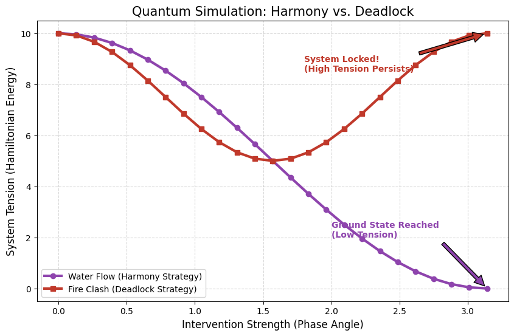

# Part 2: Spatial Topology & The Quantum Hamiltonian of Feng Shui

> **"Feng Shui is not magic; it is the intuitive optimization of topological energy landscapes."**

## 1. Abstract

While **[Part 1](../Part_1_Temporal_Dynamics)** of *The Topology of Hope* explored the **Temporal Dynamics** of the I Ching (predicting evolution over time), **Part 2** focuses on **Spatial Topology**.

This module introduces a novel theoretical framework: **Quantum Spatial Tension (QST)**. By mapping traditional Feng Shui concepts (Bagua, Five Elements) onto Quantum Mechanics (Qubits, Hamiltonian Operators), we demonstrate how spatial configurations can be mathematically modeled to predict system stability.

## 2. Theoretical Framework

### The Mapping: From Metaphysics to Physics

We propose that a physical space (or an organizational structure) can be represented as a quantum system, where "Harmony" is equivalent to the **Ground State** (lowest energy) of a Hamiltonian.

| Traditional Concept (Feng Shui) | Quantum Concept (Physics) | Computational Representation |
| :--- | :--- | :--- |
| **Space / Sector** | **Qubit State** | `|0>` (Yin) / `|1>` (Yang) |
| **Interaction (Sheng/Ke)** | **Coupling Constant ($J$)** | Tensor Product of Pauli Matrices ($Z \otimes Z$) |
| **Tension / "Sha Qi"** | **Hamiltonian Energy ($H$)** | Expectation Value $\langle \psi | H | \psi \rangle$ |
| **Harmony / "Cang Feng"** | **Ground State** | Minimization of System Tension |

### The Hypothesis

A "Good Feng Shui" configuration is one that utilizes **Constructive Interference** to lower the system's total Hamiltonian energy, effectively reducing the entropy and stress of the environment.

Conversely, a "Bad Feng Shui" configuration creates **Destructive Clashing**, locking the system in a high-tension state.

## 3. The Validation Experiment

To validate the discriminative power of this model, we simulated two distinct scenarios using a quantum circuit (simulated via Qiskit/NumPy):

### Case A: The Constructive Flow (Forbidden City & Golden Water River)
* **Initial State:** Pure Yang (Hexagram 1, *The Creative*). Extremely rigid, high structural tension.
* **Intervention:** Introducing a "Water" element (Hexagram 5, *Waiting*) via a phase rotation.
* **Result:** As the "Water" influence increases, the system tension drops significantly, reaching a stable low-energy state.

### Case B: The Destructive Clash ("Fire Burns Heaven")
* **Initial State:** Pure Yang (Hexagram 1).
* **Intervention:** Introducing a "Fire" element (Hexagram 30, *The Clinging*) into the key sector (Northwest/Metal).
* **Result:** The system tension remains locked at a critical high level (**High-Energy Locking**), indicating a failure to evolve and a risk of structural collapse.

## 4. Validation & Simulation Results: The "Effort vs. Impact" Paradox

### Why Transformation Fails: A Quantum Topological Perspective

We modeled two distinct transformation strategies to demonstrate why "change" (Phase Rotation) does not always lead to "improvement" (Energy Minimization).

Using Qiskit, we simulated the system's Hamiltonian evolution under two intervention types:

1.  **🟣 The Harmony Path (Water Strategy / ☵):**
    * **Mechanism:** Targeted intervention on specific nodes (odd indices) to create an alternating, complementary structure (Antiferromagnetic order).
    * **Result:** The system successfully dissipates internal tension, reaching a zero-energy **Ground State**. This represents a "High Trust" environment where components complement each other.

2.  **🔴 The Deadlock Path (Fire Strategy / ☲):**
    * **Mechanism:** A brute-force approach that flips every node simultaneously.
    * **Result:** While the system undergoes significant change, the internal structural conflict remains unresolved. The energy curve dips briefly but **rebounds to its original high-tension state**, illustrating a classic **"Transformation Deadlock"**—where immense effort yields zero structural gain.


*(Figure: The divergence between effective structural adjustment (Purple) and brute-force deadlock (Red). Note how the Red path returns to high tension despite maximum intervention intensity.)*

### Key Findings for Management

* **Quantifiable Friction:** The vertical gap between the two curves represents the "Cost of Poor Topology."
* **Physics of Trust:** Trust is mathematically defined here as the absence of Hamiltonian tension.
* **Actionable Insight:** Effective leadership is not about maximizing activity (moving right on the X-axis), but about selecting the correct topological intervention (choosing the Purple path).

## 5. Applications

This engine is not limited to architecture; it is a general-purpose **System Harmony Stress Test**:

1.  **BIM & Architecture:** Digital Twin simulation to predict the psychological stress of a building layout before construction.
2.  **M&A & Organization:** Simulating the compatibility of two corporate cultures (Merging "Fire" teams with "Metal" management).
3.  **Supply Chain Resilience:** Identifying "High Tension" nodes in a global network that are prone to fracture under geopolitical stress.

## 6. Getting Started

### Prerequisites
* Python 3.8+
* NumPy
* Matplotlib
* Qiskit

### Running the Simulation
Execute the main script to generate the validation plot:

## 7. Author
## Dr. Ham-Jung (Alaric) Kuo Trust System Designer | CEO, A&J Management Consulting
```bash
cd Part_2_Spatial_Topology/src
python quantum_fengshui_engine.py

